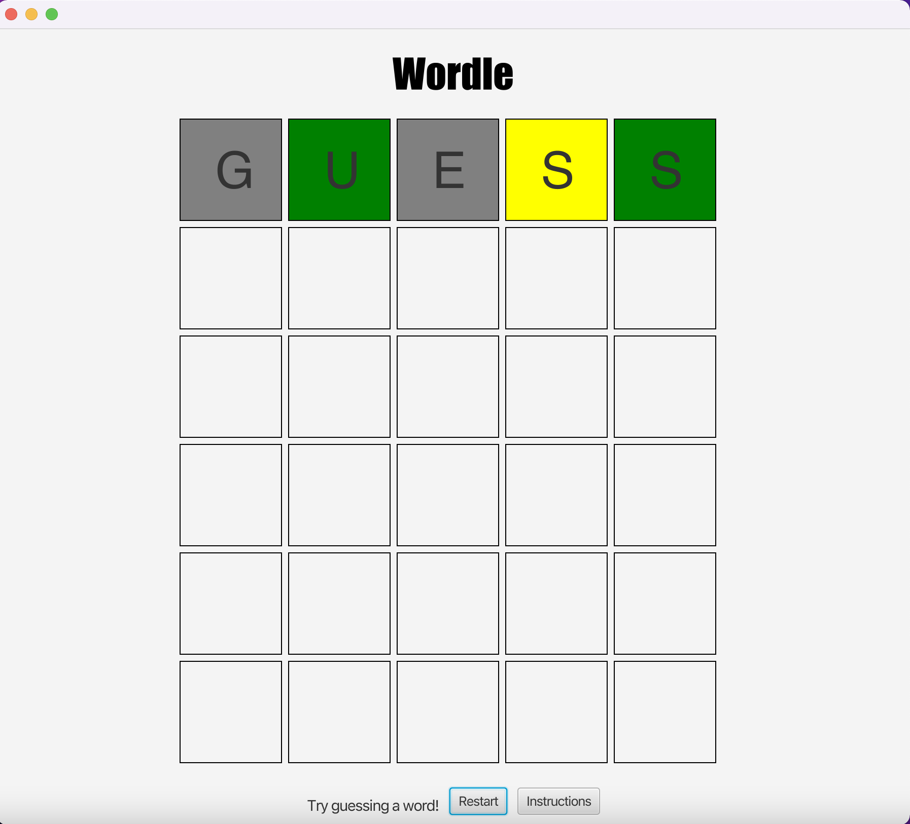
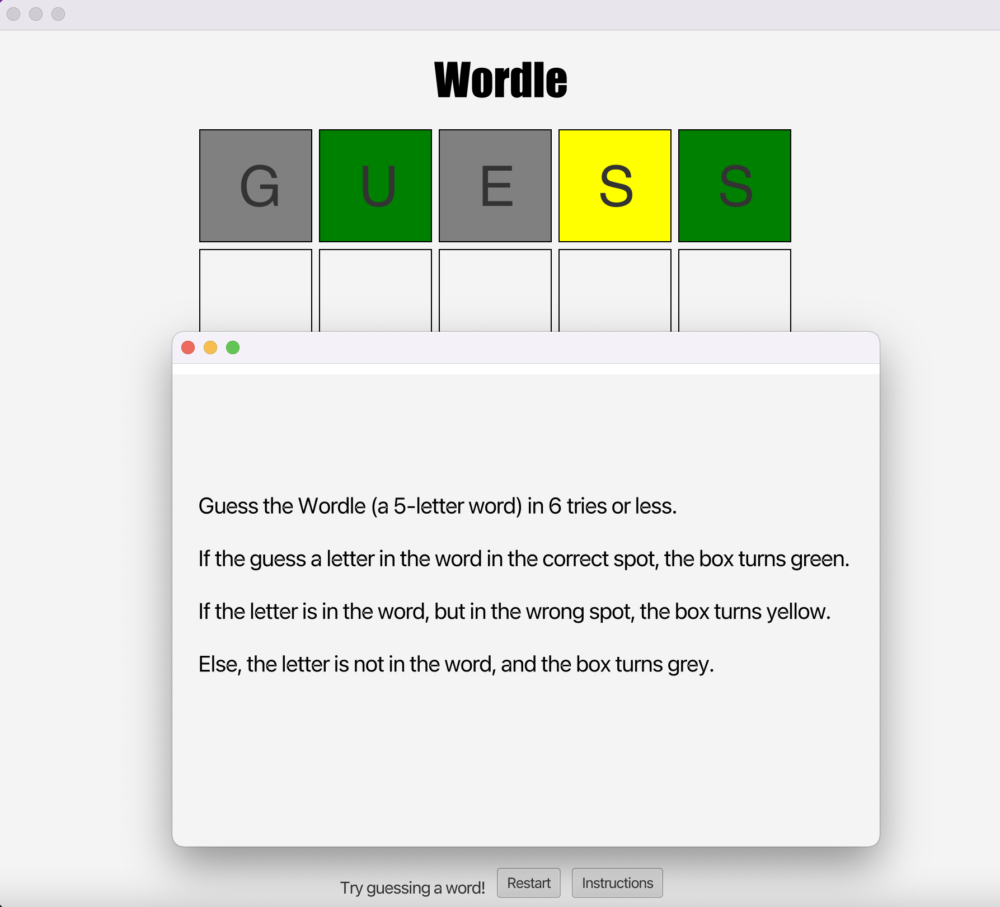

## About the Project 
Word game based on New York Time's [Wordle](https://www.nytimes.com/games/wordle/index.html). 

## Built With

## Getting Started

1. Install [JavaFx](https://openjfx.io/) 
2. Install [Apache Commons Lang Library](https://commons.apache.org/proper/commons-lang/)
3. Clone the Repo: git clone https://github.com/IshaPerry/Wordle.git
4. Add the words.txt file to the project directory 

## Usage
Guess 5-letter words using your keyboard. The backspace key deletes letter from the game. 

The "Restart" button resets the game, and the "Instructions" button provides a pop-up window with details on how to play.

## Contributing 
Any contributions you make are greatly appreciated.

If you have a suggestion that would make this better, please fork the repo and create a pull request. You can also simply open an issue with the tag "enhancement". Don't forget to give the project a star! Thank you!

1. Fork the Project
2. Create your Feature Branch (git checkout -b feature/AmazingFeature)
3. Commit your Changes (git commit -m 'Add some AmazingFeature')
4. Push to the Branch (git push origin feature/AmazingFeature)
5. Open a Pull Request

## Contact 
Isha Perry - ishaperry@gatech.edu 

Project Link: https://github.com/IshaPerry/Wordle

## Acknowledgments 
1. https://github.com/dwyl/english-words/blob/master/words.txt
2. https://github.com/othneildrew/Best-README-Template

